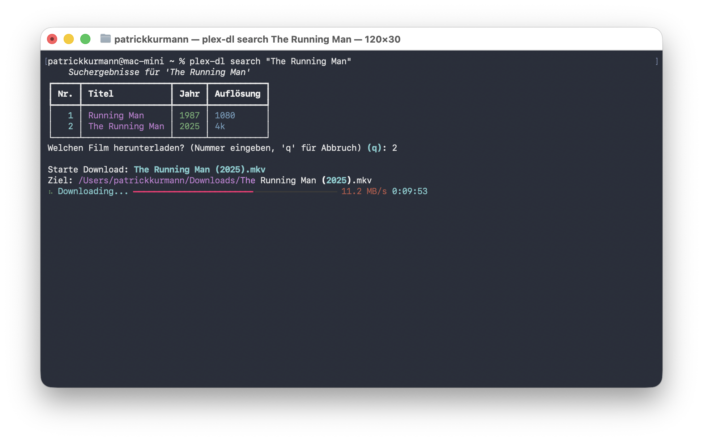

# Plex Downloader CLI

Ein modernes und interaktives Kommandozeilen-Tool (CLI), um Filme und TV Shows von einem Plex-Server in **Originalqualität** (Direct Stream) herunterzuladen.

Entwickelt von Patrick Kurmann mit Python, [Typer](https://typer.tiangolo.com/) und [Rich](https://rich.readthedocs.io/).



## Features

* **Interaktive Suche:** Suche blitzschnell nach Filmen und TV Shows in deinen Plex-Bibliotheken.
* **TV Show Support:** Lade ganze Serien oder einzelne Episoden herunter.
* **Originalqualität:** Lädt die rohe Videodatei (z. B. MKV, MP4) herunter, ohne Transcodierung oder Qualitätsverlust.
* **Schicke UI:** Fortschrittsbalken, farbige Ausgaben und formatierte Tabellen.
* **Sicherer Login:** Verbindet sich mit deinen Plex-Zugangsdaten und nutzt Tokens zur Authentifizierung.
* **Konfigurierbar:** Speichert deine Einstellungen (Server, Token, Pfad) lokal ab.

## Installation

### Option 1: Installation via pipx (Empfohlen)
Um das Tool sauber isoliert von deinem System-Python zu nutzen, ist `pipx` der beste Weg.

```bash
# Direkt von GitHub installieren
pipx install git+[https://github.com/kurmann/plex-downloader.git](https://github.com/kurmann/plex-downloader.git)

```

### Option 2: Lokale Entwicklung

Wenn du den Code verändern oder erweitern möchtest:

1. Repository klonen:
```bash
git clone [https://github.com/kurmann/plex-downloader.git](https://github.com/kurmann/plex-downloader.git)
cd plex-downloader

```


2. Virtuelle Umgebung erstellen:
```bash
python3 -m venv .venv
source .venv/bin/activate

```


3. Abhängigkeiten installieren:
```bash
pip install -e .

```

## Benutzung

Sobald das Tool installiert ist, steht dir der Befehl `plex-dl` systemweit zur Verfügung.

### 1. Ersteinrichtung (Setup)

Bevor du starten kannst, musst du dich einmalig einloggen und den gewünschten Server auswählen.

```bash
plex-dl setup

```

*Folge den Anweisungen im Terminal, um dich bei plex.tv einzuloggen und deinen Server zu wählen.*

### 2. Suchen & Herunterladen

Suche nach einem Film- oder Serientitel. Das Tool zeigt dir alle Treffer an und lässt dich auswählen, welchen du laden möchtest.

```bash
plex-dl search "Inception"

```

Für TV Shows wirst du gefragt, ob du die ganze Serie oder nur eine bestimmte Episode herunterladen möchtest.

### Konfiguration

Die Konfigurationsdatei wird standardmäßig hier gespeichert:
`~/.config/plex-downloader/config.yaml`

Dort kannst du bei Bedarf den Standard-Downloadpfad manuell anpassen.

## Projektstruktur

Dieses Projekt nutzt das moderne `src`-Layout für Python-Pakete:

```text
plex-downloader/
├── pyproject.toml       # Abhängigkeiten & Entry Point
├── src/
│   └── plex_downloader/
│       ├── __init__.py
│       └── main.py      # Die Hauptlogik der Applikation

```

## Lizenz

Dieses Projekt ist unter der MIT Lizenz veröffentlicht.

## Haftungsausschluss

Dieses Tool ist nur für den persönlichen Gebrauch gedacht. Bitte respektiere das Urheberrecht und lade nur Inhalte herunter, an denen du die Rechte besitzt oder auf die du legitimen Zugriff hast.
